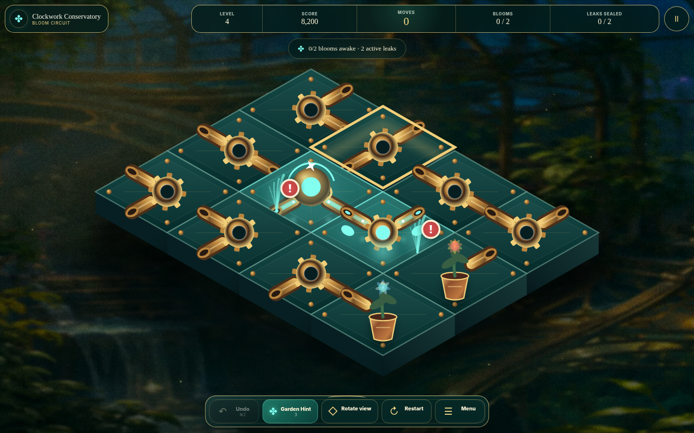

# Clockwork Conservatory: Bloom Circuit

**Clockwork Conservatory** is a premium, responsive HTML5 circuit puzzle designed for Arkadium’s adult-casual audience. Rotate brass-and-glass mechanisms, route living aetherlight from the Sunwell, awaken every flower, and seal every powered leak.



## Release candidate 1.0.0

This release replaces the original flat prototype presentation with a complete publishing-oriented experience:

- premium botanical-clockwork visual system with atmospheric conservatory environments;
- high-DPI Canvas 2D board with bevelled glass platforms, brass channels, powered flow, particles, leaks, locks, plants, selection states, and victory lighting;
- responsive desktop, tablet, and portrait-mobile layouts;
- three one-action onboarding levels;
- deterministic campaign, shared UTC Daily Bloom, and untimed Zen modes;
- restoration map, chamber progression, daily streak, score history, and a five-specimen collection;
- full menu, pause, settings, help, completion, and unlock flows;
- Arkadium SDK lifecycle, storage, ads, analytics, leaderboard, and pause/resume adapter;
- keyboard, pointer, touch, reduced-motion, high-contrast, six-language, and live-region support;
- automated deterministic gameplay, release-safety, package-budget, and browser smoke tests.

| Main menu | Restoration map |
|---|---|
|  |  |

| Victory | Mobile |
|---|---|
|  |  |

## Run locally

Requirements: Node.js 22+ and a modern browser.

```bash
npm install
npm run dev
```

The preview opens at `http://127.0.0.1:4173`. Add `?standalone=1` to skip the Arkadium SDK connection during local development.

Useful entry points:

```text
?standalone=1&autostart=campaign
?standalone=1&autostart=daily
?standalone=1&autostart=zen
?standalone=1&autostart=map
```

A successful rewarded hint can be simulated only with the explicit local flag:

```text
?standalone=1&debug=1&devReward=1
```

## Quality gates

```bash
npm run check   # strict TypeScript and release-safety checks
npm test        # build plus 820 deterministic gameplay assertions
npm run build   # production output in dist/
npm run smoke   # desktop/menu/map/gameplay/victory/mobile Chromium screenshots
npm run ci      # complete non-browser gate
```

Current measured output:

- initial HTML, CSS, JavaScript, and runtime assets: approximately **542 KiB**;
- complete `dist/`, including source maps and build report: approximately **689 KiB**;
- production package remains far below Arkadium’s public upload-scale expectations.

`dist/build-report.json` contains an exact per-file report and fails the build if the configured package budgets are exceeded.

## Controls

- Click or tap a mechanism to rotate it clockwise.
- Arrow keys move selection; `Enter` or `Space` rotates.
- `Z` undo, `H` Garden Hint, `Q`/`E` rotate view, `R` restart, `Esc` pause.

## Architecture

```text
src/
  core/       deterministic board analysis, generation, tutorials, scoring, saves
  game/       controller, premium Canvas renderer, synthesized Web Audio
  platform/   fault-tolerant Arkadium SDK adapter and lifecycle outbox
  ui/         localization with English fallback
public/
  assets/     optimized runtime environmental and specimen art
scripts/      build, checks, deterministic tests, static server, visual smoke test
artifacts/
  concepts/   approved visual direction references
  screenshots/real browser evidence generated from the implementation
```

The gameplay core has no DOM dependency. Platform APIs are isolated behind `ArkadiumBridge`; a late SDK connection replays mandatory lifecycle events in order. Missing, cancelled, or failed rewarded ads never grant a production reward.

## Publishing path

1. Deploy `dist/` to a stable HTTPS URL or enable the included GitHub Pages workflow.
2. Validate the hosted URL inside the Arkadium Sandbox on desktop, tablet, and real mobile devices.
3. Ask the assigned producer for the production analytics application ID, final ad cadence, leaderboard configuration, taxonomy, and game slug.
4. Run first-session tests with players who have not seen the game; measure time to first bloom, tutorial completion, level-two start rate, and return intent.
5. Submit the playable URL through Arkadium’s developer process.

See [Arkadium checklist](docs/ARKADIUM_CHECKLIST.md), [QA plan](docs/QA_PLAN.md), [game design](docs/GAME_DESIGN.md), and [release notes](docs/RELEASE_NOTES_1.0.0.md).
