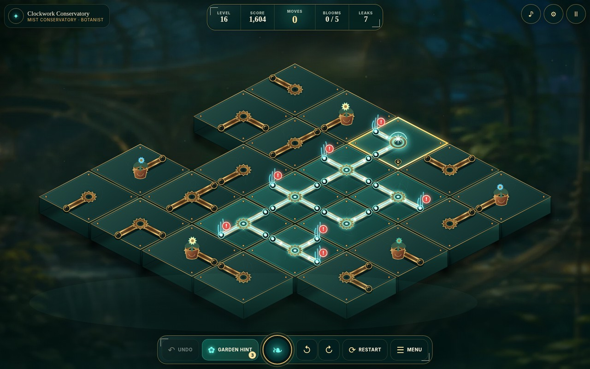

# Clockwork Conservatory: Bloom Circuit

**Clockwork Conservatory** is a premium 2.5D botanical circuit puzzle for browsers and the Arkadium Game SDK. Players rotate brass mechanisms to carry aetherlight from the Sunwell to every flower while sealing every active leak.



## Release candidate 0.3.0

This release replaces the original flat prototype presentation with a production-oriented visual and interaction layer while preserving a small, deterministic web runtime.

- Rich greenhouse environments, layered brass-and-glass tiles, illuminated energy channels, animated leaks, unique flower specimens, particles, camera motion, and a cinematic restoration sequence.
- A responsive renderer that uses an isometric composition on desktop and small mobile boards, then switches dense portrait boards to a readable top-down 2.5D composition.
- Three authored onboarding levels that teach the source, rotation, blooms, leaks, branches, and fixed mechanisms through play.
- Campaign restoration, a deterministic Daily Bloom, Zen mode, stars, streaks, specimens, resume, undo, local hints, and a restoration map.
- English, Spanish, French, German, and Italian interface tables; keyboard, touch, and mouse controls; reduced motion, high contrast, and adaptive quality modes.
- A fault-tolerant Arkadium SDK v2 bridge with ordered lifecycle delivery, local and authenticated remote persistence, analytics hooks, pause/resume callbacks, interstitials, rewarded hints, and daily leaderboards.
- No runtime generative-AI dependency, account flow, external save service, clipboard access, fullscreen toggle, or gameplay backend.

## Run locally

Requirements: Node.js 22 or newer and TypeScript 5.8.3.

```bash
npm install
npm run dev
```

The preview opens at `http://127.0.0.1:4173`. Add `?standalone=1` to skip the SDK during ordinary development. A successful rewarded-hint response can only be simulated locally with the explicit `?standalone=1&debug=1&devReward=1` combination.

## Verification

```bash
npm run check   # strict TypeScript and Arkadium safety checks
npm test        # 234 generated puzzles, tutorials, persistence, scoring, budgets
npm run build   # production output in dist/
npm run smoke   # desktop/mobile UI, gameplay, victory, dense portrait, SDK lifecycle
npm run ci      # non-browser release gate
```

The browser smoke suite builds an isolated module page, renders desktop and mobile layouts in Chromium, solves the first tutorial, opens a dense Daily board, and validates the mandatory SDK lifecycle against a mock Arena.

Current measured output is approximately **0.30 MB required for first interaction** and **0.63 MB total**, including source maps and all optional scene art. The build script fails above Arkadium's 15 MB initial and 100 MB total recommendations. A typical save is well below the SDK's 32 KB remote-value limit and the platform's 500 KB game-save maximum.

## Controls

- Click or tap a mechanism to rotate it clockwise.
- Arrow keys select a tile; `Enter` or `Space` rotates it.
- `Z` undo, `H` Garden Hint, `Q` / `E` rotate the view, `R` restart, `M` sound, `Esc` pause.

## Architecture

```text
src/
  core/       deterministic generator, network analysis, hints, scoring, saves
  game/       controller, premium Canvas 2D renderer, synthesized Web Audio
  platform/   fault-tolerant Arkadium SDK v2 adapter and lifecycle outbox
  ui/         semantic DOM shell and typed localization tables
public/
  assets/     optimized WebP scene backdrops, lazily loaded after the title scene
scripts/      build budgets, release checks, property tests, browser smoke suite
```

The puzzle model has no DOM dependency. Every generated level is a connected tree whose zero-rotation state is a verified solution. The renderer consumes the model without becoming authoritative, so resize, quality changes, camera rotation, and reduced-motion settings cannot corrupt gameplay state.

## Arkadium publishing path

1. Deploy `dist/` at a stable HTTPS URL with correct JavaScript and WebP MIME types.
2. Put that URL in the Arkadium Sandbox and validate status indicators, event logs, authenticated persistence, ads, pause/resume, leaderboard support, and display settings.
3. Ask the producer for the production App Insights application ID and place it in the `arkadium-app-insights-id` meta tag.
4. Run the real-device matrix and one-hour soak plan in `docs/QA_PLAN.md`.
5. Confirm final ad cadence, analytics taxonomy, game slug, localization review, leaderboard configuration, asset provenance, and submission metadata with the assigned producer.
6. Submit the playable link and pitch material through Arkadium's developer process.

See `docs/ARKADIUM_CHECKLIST.md`, `docs/QA_PLAN.md`, `docs/GAME_DESIGN.md`, and `docs/RELEASE_NOTES_0.3.0.md`.
