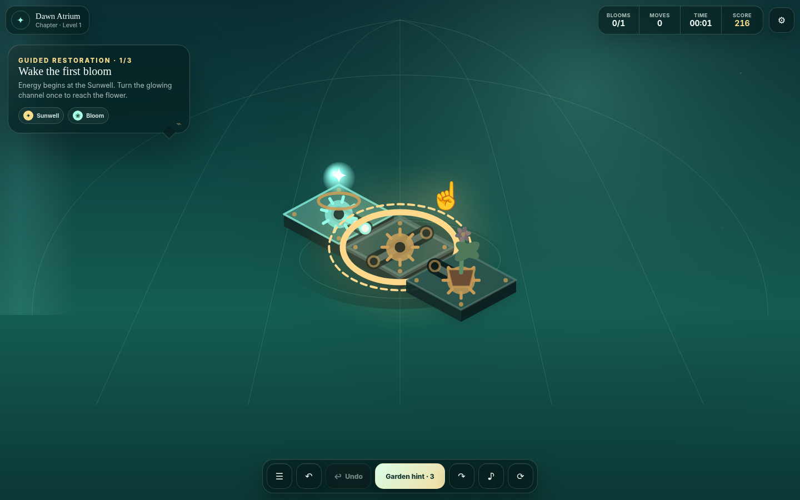

# Clockwork Conservatory

**Clockwork Conservatory: Bloom Circuit** is a production-oriented, responsive HTML5 puzzle game designed for Arkadium’s adult-casual audience and Game SDK. Players rotate clockwork irrigation mechanisms to restore a living glasshouse, bloom every plant, and seal every active leak.



## Release candidate 0.2.0

This iteration turns the original vertical slice into a stronger publishing candidate:

- Three authored, one-action onboarding levels teach the Sunwell, blooms, leaks, branches, and anchored mechanisms inside gameplay.
- The board uses more of the available viewport, with clearer powered/unpowered channels, endpoint ports, active-leak warnings, hover/selection states, and fixed-tile badges.
- A dedicated victory sequence adds energy bloom, camera emphasis, particles, rays, plant transformation, score breakdown, and specimen unlock feedback.
- The menu now exposes a lightweight restoration metagame with chamber progress and a five-specimen collection.
- “AI Hint” is now player-facing **Garden Hint** while the local adaptive director remains an implementation detail.
- Late Arkadium SDK connections replay queued mandatory lifecycle events in order.
- Rewarded hints fail closed in release/standalone mode; free preview rewards require the explicit local-only `?debug=1&devReward=1` flag.

## Why this concept fits Arkadium

- Calm, premium adult-casual puzzle play with no violence, inappropriate content, or external account flow.
- The core rule is understandable in one sentence, while guided first-session play removes ambiguity about source, flow, leaks, and fixed pieces.
- Sessions work in short breaks, while campaign restoration, specimen collection, adaptive difficulty, Daily Bloom, and leaderboards create reasons to return.
- Deterministic generation produces effectively unlimited verified content without a content server.
- Natural ad breaks exist only after completed level groups; rewarded ads are optional and player initiated.
- Canvas 2D keeps the build extremely small and fast while delivering a dimensional animated presentation.

## Production features

### Gameplay and local AI

- Three deterministic authored tutorial boards, each starting unsolved and completing in one clockwise turn.
- Deterministic, solver-verified procedural puzzle generation after onboarding.
- A local **Garden Director** adapts board size, density, fixed tiles, and pre-solved segments from a compact skill profile. Tutorial performance is excluded so assisted lessons cannot inflate difficulty.
- A local hint engine evaluates legal rotations and network improvement, with a guaranteed solution-correction fallback.
- Campaign, UTC Daily Bloom, and untimed Zen modes.
- Scoring, three-star grades, restoration progress, specimen unlocks, undo, resume, and deterministic replay.
- No runtime generative-AI service, API key, tracking SDK, or gameplay backend dependency. Core play remains available when remote services fail.

### Arkadium integration

- Arkadium Game SDK v2 loaded from the official CDN with a non-blocking standalone fallback.
- Lifecycle: `onTestReady`, one `onGameStart` / `onGameEnd` per load, level start/end, score updates, and pause/resume callbacks.
- A bounded lifecycle outbox preserves event order when the player starts before a slow SDK connection completes.
- SDK persistence: local storage for all players and remote storage for authorized players.
- Interstitial ads only at natural chapter breaks; rewarded ads only for optional hints after three free hints.
- Rewarded failure, cancellation, or missing API never grants the reward in production.
- Standard analytics events, page views, custom puzzle dimensions, completion reason, and error reporting.
- Daily leaderboard posting when the Arena supports it.
- No external login, redirects, clipboard access, fullscreen toggle, or platform navigation.

### Quality and accessibility

- Responsive from 2:1 landscape through 1:2 portrait without reloading or losing state.
- Pointer, touch, and keyboard controls, including a tutorial target selected by default for keyboard players.
- Dynamic canvas accessibility description and live-region announcements.
- High-contrast and reduced-motion options.
- English plus Spanish, French, German, and Italian UI localization, including the full guided onboarding.
- Web Audio is synthesized locally, starts only after user interaction, and suspends when the page is hidden.
- Device-pixel-ratio-aware canvas rendering, capped to protect GPU memory.

## Run locally

Requirements: Node.js 22+ and TypeScript 5.8+.

```bash
npm install
npm run dev
```

Open the printed local preview URL. Add `?standalone=1` to skip the SDK connection while developing. To simulate a successful rewarded hint locally, use the deliberately explicit `?standalone=1&debug=1&devReward=1`; this behavior is disabled unless both debug and `devReward` are present.

Useful commands:

```bash
npm run check   # TypeScript and Arkadium release-safety guardrails
npm test        # Build plus generator/tutorial/hint/save/scoring tests
npm run build   # Production output in dist/
npm run smoke   # Chromium visual, victory, responsive, and late-SDK lifecycle tests
npm run ci      # Full non-browser CI gate
```

## Controls

- Click or tap a mechanism to rotate it clockwise.
- Arrow keys move the selected mechanism; `Enter` or `Space` rotates it.
- `Z` undo, `H` Garden Hint, `Q` / `E` rotate the view, `R` restart, `M` sound, `Esc` pause.

## Architecture

```text
src/
  core/       authored tutorial, procedural generator, board analysis, hints, skill model, score, save schema
  game/       controller, Canvas 2D renderer, synthesized audio, onboarding and victory presentation
  platform/   fault-tolerant Arkadium SDK adapter and lifecycle outbox
  ui/         typed localization tables
scripts/      dependency-light build, preview, release checks, tests, visual/lifecycle smoke test
```

The gameplay core has no DOM dependencies, so its puzzles and tutorial states are deterministic and testable. Platform APIs are isolated behind `ArkadiumBridge`, and remote capabilities have a graceful local fallback without silently granting monetized rewards.

## Build budget

The build script writes `dist/build-report.json` and fails if Arkadium’s package budgets are exceeded. Current measured output is approximately:

- Initial HTML/CSS/JavaScript payload: **202.6 KB** uncompressed.
- Total production output including source maps/report: **377.1 KB**.
- Typical save: less than **2 KB**; remote values stay below the SDK’s 32 KB limit and far below Arkadium’s 500 KB game-save maximum.

## Publishing path

1. Enable GitHub Pages using the included workflow or host `dist/` over HTTPS with correct JavaScript MIME types.
2. Test the public playable URL in the Arkadium Sandbox in desktop, mobile, authenticated, unauthenticated, ad, pause/resume, late-SDK, and display-size configurations.
3. Ask the Arkadium liaison for the production App Insights app ID and place it in the `arkadium-app-insights-id` meta tag in `index.html`.
4. Have Arkadium confirm ad cadence, leaderboard configuration, final analytics taxonomy, game slug, localization review, and submission metadata.
5. Run first-session playtests with people who have never seen the game; track time to first bloom, tutorial completion, level-two start rate, and unprompted comprehension.
6. Submit the playable URL and pitch materials through Arkadium’s developer process.

See [docs/ARKADIUM_CHECKLIST.md](docs/ARKADIUM_CHECKLIST.md), [docs/QA_PLAN.md](docs/QA_PLAN.md), [docs/GAME_DESIGN.md](docs/GAME_DESIGN.md), and [docs/RELEASE_NOTES_0.2.0.md](docs/RELEASE_NOTES_0.2.0.md).

## Original assets and privacy

All visuals are rendered procedurally in code, all sound is synthesized at runtime, and no third-party art, fonts, music, cookies, trackers, or player-facing remote AI services are included. See [CREDITS.md](CREDITS.md).
