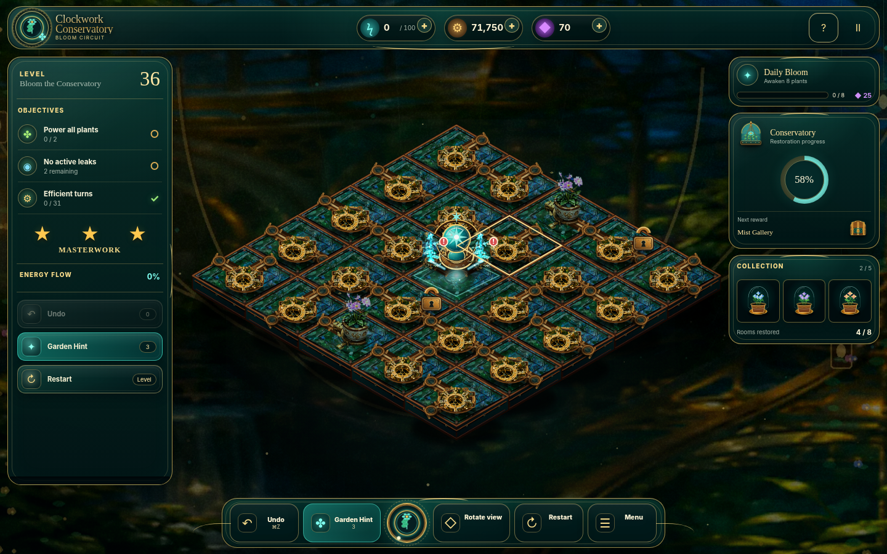
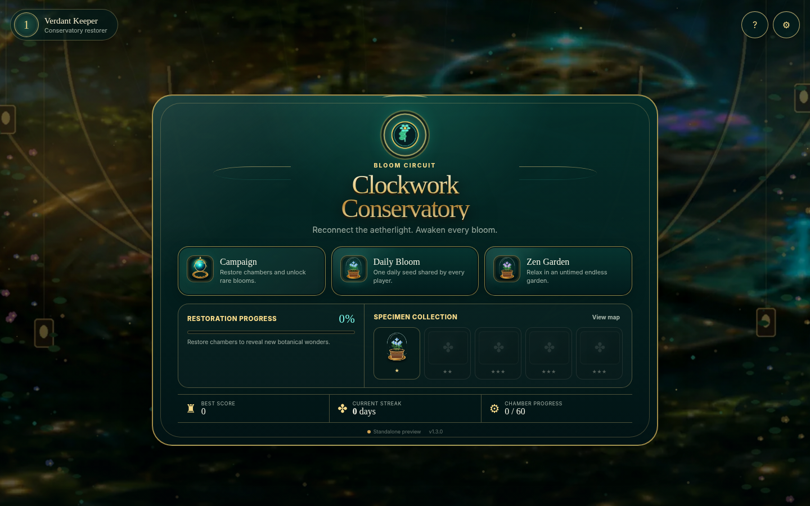
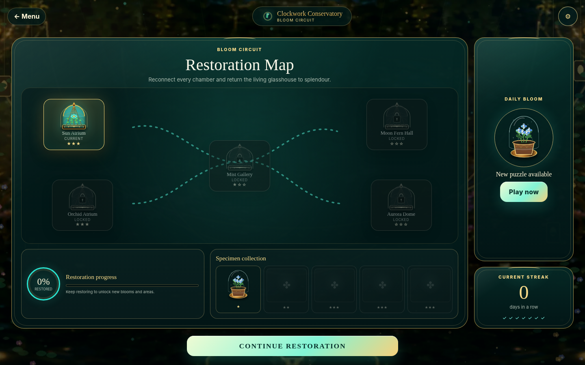
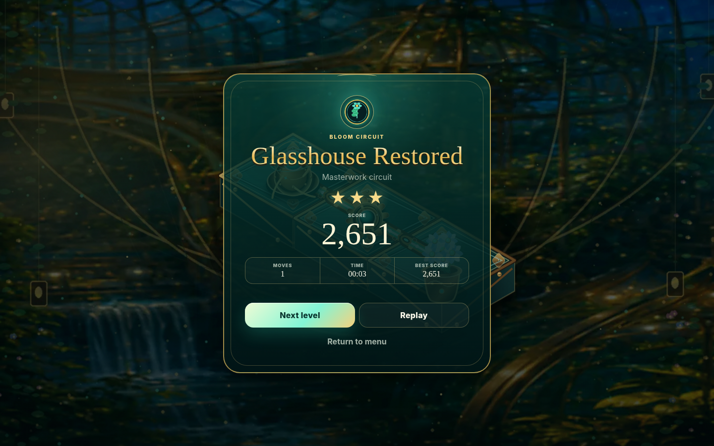
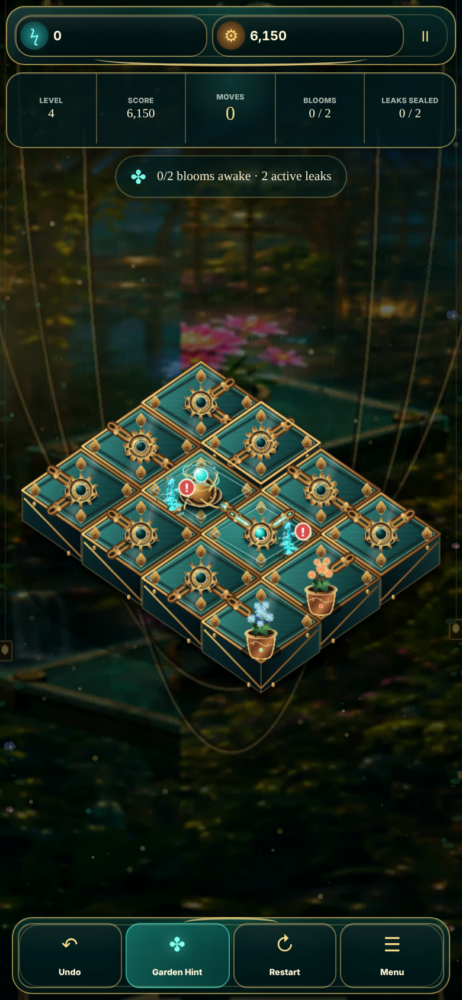

# Clockwork Conservatory: Bloom Circuit

**Clockwork Conservatory** is a premium, responsive HTML5 circuit puzzle designed for Arkadium’s adult-casual audience. Rotate brass-and-glass mechanisms, route living aetherlight from the Sunwell, awaken every flower, and seal every powered leak.



## Release candidate 1.3.0

Version 1.3.0 upgrades the **actual playable board**, not a promotional screenshot. High mode now assembles independent cinematic platforms, topology-aware regulators, pipes, couplers, plants, source, lock, and leak assets from the live puzzle state. A DPR-aware offscreen cache preserves sub-millisecond steady-state board rendering while dynamic energy, regulator dials, source orbits, pollen, impacts, selection, and victory effects remain interactive.

- four detailed isometric platform variants with physical gaps, contact shadow, dark extrusion, glass texture, brass bevels, wear, rivets, and engraved tracks;
- reference-derived terminal, straight, elbow, and junction regulators built as independent transparent runtime components;
- physically shaded brass pipes and dark ports with live three-layer cyan/white aether flow and animated endpoint travellers;
- current-puzzle selective loading plus a DPR-aware static-board cache, so cinematic quality does not require recompositing every HD sprite each frame;
- High assets prepared before the gameplay screen appears, eliminating visible art pop-in;
- clean scene plates with no baked board or interface behind the live puzzle;
- individually rendered brass-and-glass platforms, valves, distributors, Sunwell, cloches, plants, locks, leaks, and couplers;
- full desktop cockpit with live objective, flow, restoration, collection, Daily Bloom, and working tool rails;
- high-resolution botanical crest, chamber domes, reward chest, mode art, and specimen imagery across all menus;
- gameplay assets loaded on demand and cached, preserving mobile responsiveness despite the richer presentation;
- adaptive **Auto / High / Balanced** renderer profiles based on memory, CPU, network, pointer type, viewport, DPR, and sustained measured load;
- hard Canvas pixel budgets, capped DPR, bounded effects, and a renderer that fully sleeps on static screens;
- richer glass highlights, living aetherlight travelers, staged power propagation, bloom and leak-seal bursts, impact pulses, plant sway, atmospheric dust, and restoration-driven environmental lighting;
- responsive layouts for 320×568 compact phones, portrait mobile, landscape mobile, tablet, desktop, and narrow Arkadium embeds;
- pointer capture, drag rejection, coalesced hover work, haptics, keyboard navigation, immediate board feedback, and input-safe asynchronous navigation;
- visibility, Page Lifecycle, BFCache, resize, orientation, audio, save-queue, and late-SDK hardening;
- three one-action onboarding levels, deterministic campaign, shared UTC Daily Bloom, and untimed Zen modes;
- restoration map, chamber progression, daily streak, score history, and a five-specimen collection;
- Arkadium SDK lifecycle, storage, ads, analytics, leaderboard, and pause/resume adapter;
- reduced motion, high contrast, six-language UI, live-region announcements, and fail-safe remote integrations;
- deterministic, browser, resize, reduced-motion, interaction-latency, queue-bound, memory-growth, and device-profile release tests.

| Main menu | Restoration map |
|---|---|
|  |  |

| Victory | Mobile |
|---|---|
|  |  |

## Run locally

Requirements: Node.js 22+ and a modern browser.

```bash
npm install
npm run dev
```

The preview opens at `http://127.0.0.1:4173`. Add `?standalone=1` to skip the Arkadium SDK connection during local development.

Useful entry points:

```text
?standalone=1&autostart=campaign
?standalone=1&autostart=daily
?standalone=1&autostart=zen
?standalone=1&autostart=map
```

A successful rewarded hint can be simulated only with the explicit local flag:

```text
?standalone=1&debug=1&devReward=1
```

The debug flag also exposes read-only runtime diagnostics through `window.__clockworkDiagnostics()`.

## Quality gates

```bash
npm run check             # strict TypeScript and release-safety checks
npm test                  # build plus 828 deterministic gameplay assertions
npm run art:check         # dimensions, alpha, detail, colour and art-pack budgets
npm run build             # production output in dist/
npm run smoke             # responsive menu/map/gameplay/victory/accessibility matrix
npm run cinematic:smoke   # cinematic loading, cache and steady-frame contract
npm run perf              # adaptive quality, latency, payload, sleep, memory and stress
npm run release           # complete local release gate
```

The GitHub Actions browser job runs the smoke matrix in Chromium, Firefox, and WebKit and runs the performance suite in Chromium.

Current measured production output:

- complete runtime package: about **4.22 MiB** before source maps;
- complete `dist/`, including source maps and build report: about **4.50 MiB**;
- mobile menu resources: about **763 KiB encoded**, with the Canvas fully asleep after entrance;
- cumulative first gameplay: about **0.94 MiB encoded** on Balanced and **2.57 MiB encoded** on High;
- the package remains well below the enforced **15 MB initial / 100 MB total** Arkadium budgets.

Representative local Chromium guardrails in `artifacts/performance-report.json`:

- constrained 4 GB / 4-core phone under 2× CPU throttle: Balanced, DPR 1.5, 740,610 Canvas pixels, about **4.6 ms** measured average draw cost and **9.7 ms** input-to-render;
- strong 8 GB / 8-core phone: High, DPR 2, 1,316,640 Canvas pixels, cached steady frames around **0.35 ms**, with **42.0 ms** input-to-render;
- desktop: High, DPR 1, 1,296,000 Canvas pixels, cached steady frames around **0.39 ms** and **69.2 ms** input-to-render in the automated harness;
- static mobile menu: zero Canvas frames during the one-second sleep sample;
- 72-cycle low-end stress pass: DOM stayed at 416 nodes, no overflow or browser error occurred, and renderer queues remained bounded.

These are automated local guardrails rather than a substitute for Arkadium Sandbox and physical-device QA.

## Controls

- Click or tap a mechanism to rotate it clockwise.
- Arrow keys move selection; `Enter` or `Space` rotates.
- `Z` undo, `H` Garden Hint, `Q`/`E` rotate view, `R` restart, `Esc` pause.

## Architecture

```text
src/
  core/       board analysis, generation, tutorials, scoring, saves, performance profiles
  game/       controller, adaptive premium Canvas renderer, synthesized Web Audio
  platform/   fault-tolerant Arkadium SDK adapter and lifecycle outbox
  ui/         localization with English fallback
public/
  assets/     optimized environment, UI, Balanced art and cinematic runtime pieces
scripts/      build, checks, deterministic tests, browser matrix, performance guardrails
artifacts/
  concepts/   visual direction references
  screenshots/real browser evidence generated from the implementation
```

The gameplay core has no DOM dependency. Platform APIs are isolated behind `ArkadiumBridge`; a late SDK connection replays mandatory lifecycle events in order. Missing, cancelled, or failed rewarded ads never grant a production reward. The renderer never depends on a remote asset or runtime AI service.

## Publishing path

1. Deploy `dist/` to a stable HTTPS URL or enable the included GitHub Pages workflow.
2. Validate the hosted URL inside the Arkadium Sandbox on desktop, tablet, and physical mobile devices.
3. Ask the assigned producer for the production analytics application ID, final ad cadence, leaderboard configuration, taxonomy, and game slug.
4. Run first-session tests with players who have not seen the game; measure time to first bloom, tutorial completion, level-two start rate, and return intent.
5. Complete physical-device, one-hour soak, throttled-network, and late-SDK testing before live publication.
6. Submit the playable URL through Arkadium’s developer process.

See the [Arkadium checklist](docs/ARKADIUM_CHECKLIST.md), [QA plan](docs/QA_PLAN.md), [performance notes](docs/PERFORMANCE.md), [game design](docs/GAME_DESIGN.md), and [1.3.0 release notes](docs/RELEASE_NOTES_1.3.0.md).
